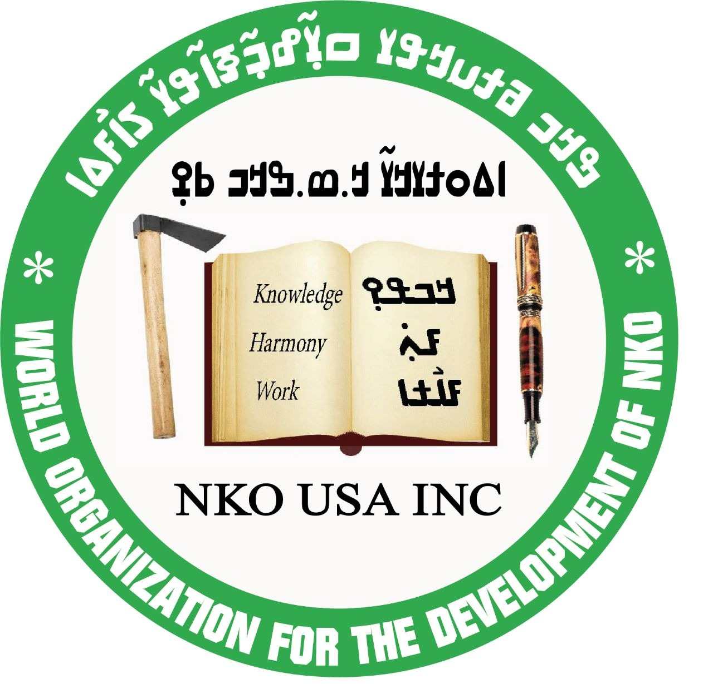

# nicolingua-0005-nqo-nmt-resources
This package contains training corpora for machine translation system development for the [n'ko language](https://en.wikipedia.org/wiki/N%27Ko_language) written in the [n'ko script](https://en.wikipedia.org/wiki/N%27Ko_script).

Included datasets were curated from files provided by Baba Mamadi Diané, Solo Farabado Cissé, Djibrila Diané, Nafadji Sory Condé and Kalo Mory Diané

## 2023-06-19: WMT 2023 N'ko NMT Task details
- train sets:
  - nicolingua-0005-nqo-nmt-resources (this dataset)
  - [common-parallel-corpora/multitext-nllb-seed](https://github.com/common-parallel-corpora/common-parallel-corpora)
- dev set:
  - [common-parallel-corpora/flores-200-dev](https://github.com/common-parallel-corpora/common-parallel-corpora)
- test set:
  - [common-parallel-corpora/flores-200-devtest](https://github.com/common-parallel-corpora/common-parallel-corpora)

## Dataset Description
|corpora type|languages|parallel entries|nqo words|
|--|--|--:|--:|
|trilingual|nqo_Nkoo, eng_Latn, fra_Latn|25 848|256 934|
|bilingual|nqo_Nkoo, eng_Latn|59 442|283 279|
|bilingual|nqo_Nkoo, fra_Latn|45 560|129 789|
|monolingual|nqo_Nkoo|N/A|3 291 371|
|*total*||130 850|3 961 373|

## trilingual corpora {nqo_Nkoo, eng_Latn, fra_Latn}
|    lines |  words | path | description |
|--:|--:|--|--|
|    6236 |  175382 | data/baba_mamadi_diane_parallel_002.nqo_Nkoo|quran|
|    6236 |  151323 | data/baba_mamadi_diane_parallel_002.eng_Latn||
|    6236 |  171085 | data/baba_mamadi_diane_parallel_002.fra_Latn||
|--|--|--|--|
|    7001 |   28626 | data/kalo_mory_diane_parallel_001.nqo_Nkoo|various short phrases|
|    7001 |   17558 | data/kalo_mory_diane_parallel_001.eng_Latn||
|    7001 |   21593 | data/kalo_mory_diane_parallel_001.fra_Latn||
|--|--|--|--|
|    4001 |   18864 | data/kalo_mory_diane_parallel_003.nqo_Nkoo|various short phrases|
|    4001 |   12891 | data/kalo_mory_diane_parallel_003.eng_Latn||
|    4001 |   15050 | data/kalo_mory_diane_parallel_003.fra_Latn||
|--|--|--|--|
|    3999 |   17903 | data/kalo_mory_diane_parallel_002.nqo_Nkoo|various short phrases|
|    3999 |   12237 | data/kalo_mory_diane_parallel_002.eng_Latn||
|    3999 |   14495 | data/kalo_mory_diane_parallel_002.fra_Latn||
|--|--|--|--|
|    3052 |   13420 | data/solo_farabado_cisse_parallel_002.nqo_Nkoo|various short phrases|
|    3052 |    9615 | data/solo_farabado_cisse_parallel_002.eng_Latn||
|    3052 |   11308 | data/solo_farabado_cisse_parallel_002.fra_Latn||
|--|--|--|--|
|    1559 |    2739 | data/solo_farabado_cisse_parallel_001.nqo_Nkoo|locales (countries, nationalities, continents, regions, time zones, cities, currencies)|
|    1559 |    2382 | data/solo_farabado_cisse_parallel_001.eng_Latn||
|    1559 |    2338 | data/solo_farabado_cisse_parallel_001.fra_Latn||

## bilingual corpora {nqo_Nkoo, eng_Latn}
|    lines |  words | path | description |
|--|--|--|--|
|   21590 |  154238 | data/baba_mamadi_diane_parallel_003.nqo_Nkoo|short phrases from the quran|
|   21590 |  133369 | data/baba_mamadi_diane_parallel_003.eng_Latn||
|--|--|--|--|
|   36211 |  119536 | data/baba_mamadi_diane_parallel_004.nqo_Nkoo|smartphone localization strings|
|   36211 |   72612 | data/baba_mamadi_diane_parallel_004.eng_Latn||
|--|--|--|--|
|     492 |    4666 | data/djibrila_diane_parallel_003.nqo_Nkoo|short phrases including basic scientific terminology|
|     492 |    4122 | data/djibrila_diane_parallel_003.eng_Latn||
|--|--|--|--|
|    1001 |    3536 | data/djibrila_diane_parallel_001.nqo_Nkoo|short phrases in various tenses|
|    1001 |    3487 | data/djibrila_diane_parallel_001.eng_Latn||
|--|--|--|--|
|     148 |    1303 | data/djibrila_diane_parallel_002.nqo_Nkoo|various phrases|
|     148 |    1361 | data/djibrila_diane_parallel_002.eng_Latn||

# bilingual corpora {nqo_Nkoo, fra_Latn}
|    lines |  words | path | description |
|--|--|--|--|
|   37894 |   40436 | data/baba_mamadi_diane_parallel_001.nqo_Nkoo|ߒߞߏ-francais dictionary|
|   37894 |   41598 | data/baba_mamadi_diane_parallel_001.fra_Latn||
|--|--|--|--|
|    3604 |   39020 | data/nafadji_sory_conde_parallel_001.nqo_Nkoo|various phrases|
|    3604 |   35037 | data/nafadji_sory_conde_parallel_001.fra_Latn||
|--|--|--|--|
|    1141 |   22379 | data/nafadji_sory_conde_parallel_003.nqo_Nkoo|various phrases related to Guinean society|
|    1141 |   21049 | data/nafadji_sory_conde_parallel_003.fra_Latn||
|--|--|--|--|
|    2200 |   16091 | data/nafadji_sory_conde_parallel_002.nqo_Nkoo|various phrases|
|    2200 |   15413 | data/nafadji_sory_conde_parallel_002.fra_Latn||
|--|--|--|--|
|     721 |   11863 | data/nafadji_sory_conde_parallel_004.nqo_Nkoo|Guinean constitution|
|     721 |   11345 | data/nafadji_sory_conde_parallel_004.fra_Latn||

# monolingual corpora {nqo_Nkoo}
|    lines |  words | path | description | 
|--:|--:|--|--|
|  134000 |  2017158 | data/nafadji_sory_conde_monolingual_001.nqo_Nkoo| from books and newspapers in n'ko|
|   44604 |   853464 | data/baba_mamadi_diane_monolingual_002.nqo_Nkoo| |
|   10195 |   420749 | data/baba_mamadi_diane_monolingual_001.nqo_Nkoo| |

## Contributors
- Moussa Koulako Bala Doumbouya, Stanford University
- Baba Mamadi Diané, N'ko USA Inc.
- Solo Farabado Cissé, N'ko USA Inc.
- Djibrila Diané, N'ko USA Inc.
- Nafadji Sory Condé
- Kalo Mory Diané
- Christopher D Manning, Stanford University

## Ackowledgement
<table>
  <tr>
    <td>
      N'ko ߒߞߏ USA
    </td>
    <td>
      Stanford University
    </td>
  </tr>
  <tr>
    <td>
      
    </td>
    <td>
      
    </td>
  </tr>
</table>

## License
 This work is licensed under a <a rel="license" href="http://creativecommons.org/licenses/by-sa/4.0/">Creative Commons Attribution-ShareAlike 4.0 International License</a>.

